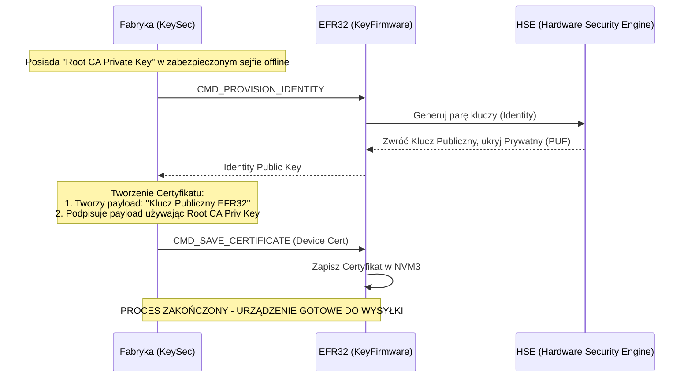
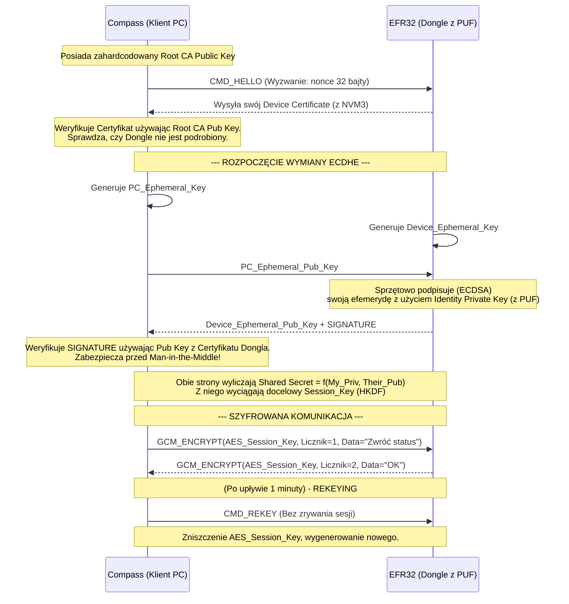

# Architektura Kryptograficzna (Wariant B+ ECDHE z Root CA)

Ten dokument precyzuje przepływ informacji, rolę oraz miejsce przechowywania każdego elementu używanego w procesie kryptograficznym chroniącym aplikację `Compass` oraz układ sprzętowy `KeyFirmware`.

## 1. Wykaz wszystkich używanych kluczy

Poniższa tabela zbiera wszystkie klucze kryptograficzne wykorzystywane w systemie:

| Nazwa Klucza | Gdzie jest generowany? | Gdzie i jak jest przechowywany? | Do czego służy? | Poufność |
|---|---|---|---|---|
| **Root CA Private Key** | Skrypt narzędziowy (np. `KeySec`) na odizolowanym komputerze firmowym w fabryce. | Zabezpieczony plik (np. `.pem` z hasłem) offline. **Nigdy** nie trafia do klienta. | Podpisywanie publicznych certyfikatów tożsamości dla nowo wyprodukowanych Dongli. (Provisioning). | **KRYTYCZNA** |
| **Root CA Public Key** | Wyciągany z Root CA Private Key. | Wkompilowany na stałe (zahardcodowany) w kod aplikacji klienckiej `Compass`. | Weryfikacja autentyczności (podpisu) podłączonego Dongla. PC sprawdza czy certyfikat Dongla pochodzi z Twojej fabryki. | Jawny |
| **PUF Root Key (RK)** | Krzem EFR32MG24 (Automatycznie przy starcie, fizyka układu SRAM). | Znajduje się tylko w lotnych komórkach sprzętowych i jest ukryty przed głównym procesorem Cortex-M33. Znika po wyłączeniu prądu. | Używany przez wbudowany sprzętowy akcelerator (HSE) do szyfrowania (wrapping) innych kluczy trzymanych we Flaszu. | **KRYTYCZNA** |
| **Identity Private Key (Device)** | Wnętrze procesora krypto EFR32 (podczas procesu provisioningu). | Przechowywany we Flaszu (NVM3), ale jest zaszyfrowany (wrapped) kluczem PUF. Nikt (nawet Twój kod C) nie ma do niego dostępu tekstowego. | Tożsamość urządzenia. Używany wyłącznie do podpisywania klucza efemerycznego w trakcie wpinania do USB, by udowodnić, że to oryginalny dongle. | **KRYTYCZNA** |
| **Identity Public Key (Device)** | Wyciągany z powyższego Identity Private Key w trakcie provisioningu. | Część Certyfikatu Urządzenia (Device Certificate) trzymanego jawnie w pamięci Flash NVM3 Dongla. Wysyłany do PC na start. | Weryfikowany przez PC, poświadcza o powiązaniu fizycznego urządzenia z fabryką. | Jawny |
| **PC Ephemeral Key (ECDHE)** | Proces RAM pythona (`Compass`) na komputerze klienta, przy każdym połączeniu. | Pamięć RAM aplikacji. Zniszczony po wyliczeniu klucza sesji. | Połówka zagadki Diffie-Hellman do wyliczenia klucza sesji. Zmienia się po odpięciu/wymuszonej rotacji. | Chroniona (PFS) |
| **Device Ephemeral Key (ECDHE)** | Mikrokontroler EFR32MG24, przy każdym podłączeniu. | Pamięć RAM ukłądu krypto. Zniszczony po wyliczeniu klucza sesji. | Druga połówka zagadki Diffie-Hellman. | Chroniona (PFS) |
| **Session Key (AES-256-GCM)** | Wynik równania (KDF) na obu urządzeniach (PC i Dongle) na podstawie wymiany Efemerycznej. | RAM komputera PC oraz lotne sloty koprocesora w EFR32. Znika całkowicie po rotacji klucza (np. po minucie) lub po wyjęciu kabla USB. | Główne "mięso". Tym kluczem szyfrujemy fizyczne dane lecące przez port COM. Zmiana chroni przed zrzutem pamięci RAM komputera. | **WYSOKA** |

---

## 2. Diagramy Przepływu (Flow)

### Proces A: Provisioning (Produkcja w Fabryce)
Ten proces wykonujesz u siebie przy biurku po zlutowaniu płytki, za pomocą skryptów `KeySec`.

### Proces B: Handshake i Ochrona (U Klienta)
Ten proces uruchamia się natychmiast za każdym razem, gdy oprogramowanie klienckie (`Compass`) próbuje "pogadać" z Donglem.

